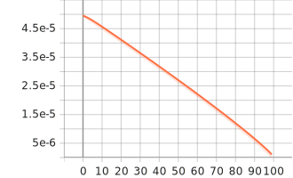
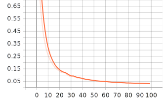
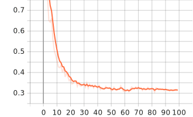
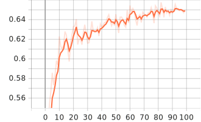
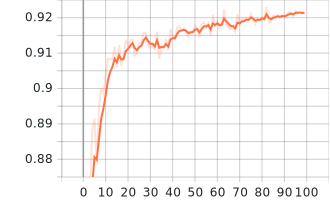
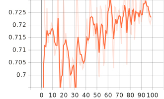
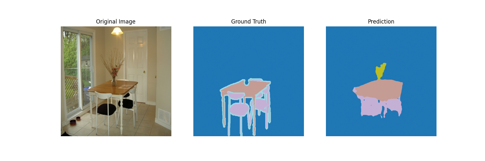
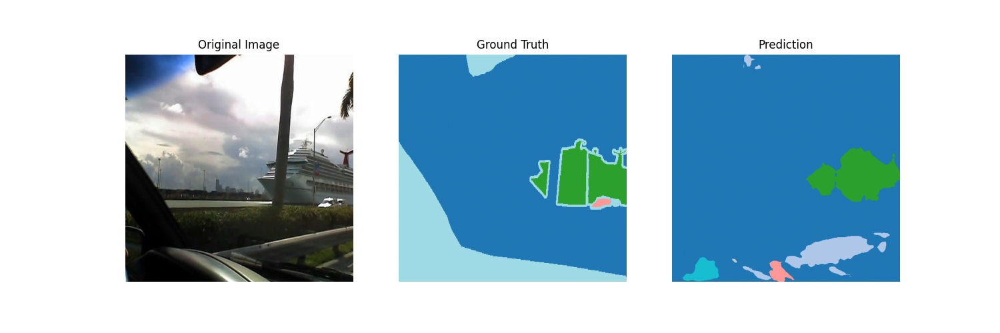

# 1 任务描述
语义分割任务旨在对图像中的每一个像素进行分类，从而实现对不同物体或区域的精确分割。该任务要求模型识别出图像中存在的各类目标，并准确地标注它们的具体位置和边界。语义分割广泛应用于自动驾驶、医学影像分析和遥感等领域，对提升图像理解能力具有重要意义。

# 2 数据集介绍
## 2.1 PASCAL VOC 2012数据集概述
采用 PASCAL VOC 2012 数据集进行语义分割任务的训练和评估。PASCAL VOC（Visual Object Classes）数据集是计算机视觉领域的经典基准数据集，广泛应用于目标检测、语义分割等任务。VOC 2012数据集包含21个类别，涵盖了背景（background）以及20个前景目标类别，包括飞机（aeroplane）、自行车（bicycle）、鸟类（bird）、船只（boat）、瓶子（bottle）、公交车（bus）、汽车（car）、猫（cat）、椅子（chair）、牛（cow）、餐桌（diningtable）、狗（dog）、马（horse）、摩托车（motorbike）、人（person）、盆栽植物（pottedplant）、羊（sheep）、沙发（sofa）、火车（train）和电视显示器（tvmonitor）等日常生活中常见的物体。

## 2.2 数据集分割策略
为了确保模型训练和评估的有效性，对数据集进行了合理的分割。采用了三部分数据分割策略：从原始训练集中按照 9: 1 的比例随机划分出训练集和验证集，同时使用 VOC 官方提供的验证集作为最终测试集。训练集用于模型参数的学习和优化，验证集用于超参数调优和模型选择，测试集用于最终模型性能的客观评估。设置了随机种子（seed=42）保证了实验的可重复性。

## 2.3 数据预处理与增强
针对语义分割任务的特点，实施了全面的数据预处理和增强策略。所有图像和对应的分割掩码都被统一调整为512×512像素的尺寸，以适应模型的输入要求。在训练阶段，为了提高模型的泛化能力和鲁棒性，采用了多种数据增强技术：包括随机旋转（±10度范围）、随机色彩抖动（调整亮度、对比度、饱和度和色调）、随机高斯模糊、随机裁剪（缩放比例0.7-1.0，宽高比0.9-1.1）以及随机水平翻转。所有图像都进行了标准化处理，使用 ImageNet 预训练模型的均值\[0.485, 0.456, 0.406\]和标准差\[0.229, 0.224, 0.225\]。在处理分割掩码时，始终使用最近邻插值以保持类别标签的准确性，避免产生无效的中间值。
# 3 模型架构
## 3.1 DeepLabV3+整体架构
采用了DeepLabV3+（DeepLab version 3+）作为语义分割的核心模型。DeepLabV3+是一种先进的端到端语义分割架构，它结合了编码器-解码器结构与空洞卷积技术，能够有效地捕获多尺度上下文信息并恢复细节边界信息。该架构整体包含编码器（Encoder）、空洞空间金字塔池化模块（ASPP）、解码器（Decoder）三个主要组成部分。
## 3.2 编码器架构

编码器部分采用ResNet-50作为骨干网络（backbone），利用ImageNet预训练权重进行初始化以提升模型收敛速度和性能。编码器的具体结构如下：
- 输入层：接收3通道RGB图像输入（512×512×3）
- 初始卷积层：7×7卷积核，步长为2，输出64个特征图
- 最大池化层：3×3池化核，步长为2，进一步降低分辨率
- 残差块组：
     Layer1：输出256通道特征图，下采样率1/4
     Layer2：输出512通道特征图，下采样率1/8
     Layer3：输出1024通道特征图，下采样率1/16
     Layer4：输出2048通道特征图，下采样率1/32

其中Layer1的输出作为低层特征（low-level features）被保存，用于解码器阶段的特征融合，以恢复细节信息。

## 3.3 空洞空间金字塔池化模块（ASPP）
ASPP模块模块通过并行使用不同空洞率的空洞卷积来捕获多尺度上下文信息，具体包含：
- 1×1卷积：捕获点特征，空洞率为1
- 3×3空洞卷积：三个并行分支，空洞率分别为6、12、18
- 全局平均池化：通过自适应平均池化获取全局上下文信息
每个分支的输出通道数均为256，最终将5个分支的特征图在通道维度上进行拼接，得到1280维特征，再通过1×1卷积降维至256维。ASPP模块能够在不增加参数量和计算复杂度的情况下，有效扩大感受野，捕获不同尺度的语义信息。

## 3.4 解码器架构
解码器负责逐步恢复空间分辨率并融合多层次特征信息。解码器的工作流程如下：
1. ASPP特征上采样：将ASPP输出的特征图从1/32分辨率上采样至1/4分辨率
2. 低层特征处理：将编码器Layer1的256维低层特征通过1×1卷积降维至48维
3. 特征融合：将上采样后的ASPP特征（256维）与处理后的低层特征（48维）在通道维度拼接，得到304维融合特征
4. 特征细化：通过两个连续的3×3卷积层对融合特征进行精细化处理，每层后接批归一化和ReLU激活函数
5. 分类预测：使用1×1卷积将特征映射为21个类别的预测结果
6. 最终上采样：将预测结果上采样至原始图像尺寸（512×512）

## 3.5 网络参数配置
模型的关键参数配置如下：
- 输入通道数：3（RGB图像）
- 输出类别数：21（VOC 2012数据集类别数）
- 骨干网络：ResNet-50（使用ImageNet预训练权重）
- ASPP输出维度：256
- 低层特征维度：48（从256维降维）
- 解码器融合特征维度：304（256+48）

# 4 训练过程
## 4.1 超参数配置
基于DeepLabV3+模型特点和PASCAL VOC 2012数据集规模，对训练超参数配置：
- 批处理大小（Batch Size）：32 - 在保证GPU内存使用效率的同时，提供足够的梯度稳定性
- 训练轮次（Epochs）：100 - 确保模型充分收敛
- 学习率（Learning Rate）：$5 \times 10^{-5}$ - 采用较小的学习率以确保稳定训练
- 权重衰减（Weight Decay）：$5 \times 10^{-5}$ - 防止过拟合，提高模型泛化能力
- 随机种子（Random Seed）：42 - 保证实验的可重复性
- 验证集比例（Validation Ratio）：0.1 - 从训练集中划分10%作为验证集

## 4.2 优化策略
训练过程采用了以下优化策略以提升模型性能：
### 4.2.1 优化器选择
使用AdamW优化器进行参数更新。AdamW结合了Adam优化器的自适应学习率特性和权重衰减正则化，能够有效处理深度网络的优化问题，避免在训练后期出现梯度爆炸或消失。

### 4.2.2 学习率调度
实施了Polynomial学习率衰减策略（PolyLR），其公式为：
$$lr_{epoch} = lr_{base} \times \left(1 - \frac{epoch}{max\_epochs}\right)^{power}$$
其中power设置为0.9，该策略能够在训练初期保持较高的学习率以快速收敛，在训练后期逐渐降低学习率以实现精细调优。

### 4.2.3 损失函数
采用交叉熵损失函数（CrossEntropyLoss），并设置 ignore\_index=255 来忽略数据集中的无效像素标签。该损失函数适用于多类别分类任务，能够有效优化像素级别的分类精度。

## 4.3 训练流程
训练过程遵循标准的监督学习流程：
1. 模型初始化：加载预训练的ResNet-50权重作为编码器初始化
2. 数据加载：批量加载预处理后的图像和分割掩码
3. 前向传播：计算模型预测输出
4. 损失计算：使用交叉熵损失评估预测与真实标签的差异
5. 反向传播：计算梯度并更新模型参数
6. 学习率更新：根据PolyLR策略调整学习率
7. 验证评估：每轮训练后在验证集上评估模型性能
8. 模型保存：保存在验证集上表现最佳的模型权重

## 4.4 评估指标
训练过程中采用多种指标来全面评估模型性能：
平均交并比（mIoU）：衡量分割精度的核心指标，计算所有类别IoU的平均值
像素准确率（Pixel Accuracy）：正确分类像素占总像素的比例
平均像素准确率（Mean Pixel Accuracy）：各类别像素准确率的平均值
训练损失和验证损失：监控模型的收敛情况和过拟合风险

## 4.5 训练监控
使用TensorBoard记录训练过程中的关键指标变化，包括：
 学习率变化曲线 - 验证PolyLR调度策略的有效性
 训练集和验证集损失曲线 - 监控模型收敛和过拟合情况
 验证集性能指标曲线 - 跟踪mIoU、pixel\_acc、mean\_pixel\_acc的变化趋势

## 4.6 训练结果分析
基于100轮的完整训练过程，模型展现出良好的收敛特性：
### 4.5.1 学习率变化
学习率从初始的$5 \times 10^{-5}$开始，随着训练进行按照多项式衰减策略平滑下降，在训练结束时降至接近零的数值，这种渐进式的学习率衰减确保了模型能够在训练后期进行精细优化。

### 4.5.2 损失函数收敛
训练损失和验证损失曲线均展现出良好的收敛特性。训练损失从初始值快速下降，在前20轮训练中下降最为明显，降至约0.15左右，随后下降速率逐渐放缓，在40轮后趋于平稳，最终稳定在0.04附近。这表明模型在训练集上的拟合能力不断提升，并最终达到稳定状态。

验证损失同样呈现出类似的收敛趋势，从初始的0.7左右快速下降到第20轮时的0.35左右，随后进入缓慢下降阶段，最终在训练结束时稳定在0.3左右。验证损失保持持续下降趋势，表明模型泛化性能良好，没有出现明显的过拟合现象。

### 4.6.3 性能指标提升
下面是训练过程中验证集上的性能指标提升过程：

mIoU 逐步提升，最终达到预期的分割精度水平。从曲线可以观察到，模型的 mIoU 指标呈现明显的三阶段提升趋势：在训练初期(1-15轮)快速上升，从0.55迅速提升至约0.62，表明模型在早期阶段能够快速学习基本的分割特征；中期阶段(15-60轮)呈现稳定但波动的上升态势，mIoU 从0.62逐渐提高到0.64，期间出现多次波动，显示模型在优化过程中不断调整以捕获更复杂的特征表示；后期阶段(60-100轮)趋于稳定，最终 mIoU 维持在0.65左右，波动幅度减小，表明模型已基本收敛。

Pixel Accuracy 在训练初期快速上升，前10轮内由0.88提升至0.91左右，随后进入平稳提升阶段，最终在0.92附近趋于稳定。整体曲线波动较小，说明模型能够持续提升对像素级别的分类能力，并在训练后期保持较高的准确率。这表明模型不仅能够有效学习全局语义信息，同时也具备良好的泛化能力，未出现明显的过拟合现象。

Mean Pixel Accuracy 在训练初期快速提升，由0.70左右上升至0.72以上，随后整体呈现缓慢上升趋势，但波动较为明显。曲线的波动反映出不同类别像素的准确率在训练过程中存在一定的不稳定性，可能与部分小众类别样本较少、难以学习有关。尽管如此，整体均值仍保持在较高水平，说明模型对大多数类别的像素分类能力较强。后期曲线趋于平稳，表明模型已基本收敛，具备较好的泛化能力。

训练过程中定期保存模型检查点，并根据验证集mIoU指标自动保存最佳模型权重，确保获得性能最优的最终模型用于测试评估。

# 5 测试结果
## 5.1 测试流程说明
测试阶段主要用于评估训练好的模型在PASCAL VOC 2012官方验证集（val split）上的泛化能力。具体流程如下：
- 加载训练好的 DeepLabV3+ 模型权重，并切换到eval模式，确保推理时不会更新参数。
- 加载 VOC2012 验证集，批量读取图像及其对应的分割掩码。
- 对每个批量的图像进行前向推理，输出每个像素的类别预测。采用交叉熵损失函数计算验证损失。
- 逐批量更新混淆矩阵，用于后续指标计算。
- 推理结束后，基于混淆矩阵计算各类别 IoU、平均 IoU（mIoU）、像素准确率（Pixel Accuracy）、平均像素准确率（Mean Pixel Accuracy）。
- 随机选取部分样本，将原图、真实掩码和模型预测结果并排保存，便于直观对比模型分割效果。

## 5.2 测试结果分析
### 5.2.1 整体性能
验证集损失（Validation Loss）：0.2679
平均 IoU（Mean IoU）：0.6926
像素准确率（Pixel Accuracy）：0.9286
平均像素准确率（Mean Pixel Accuracy）：0.7815
各类别 IoU：
部分类别 IoU 较高，如背景（0.9274）、飞机（0.8745）、猫（0.8351）、公交车（0.8518）等，说明模型对这些类别的分割效果较好。部分小众或形态复杂类别（如椅子、沙发、盆栽植物等）IoU相对较低，主要受限于样本数量和类别特征复杂度。

### 5.2.2 可视化示例分析
下图展示了模型在测试集上的典型分割效果：
该分割结果表明模型对大物体（如桌子、椅子）具有较强的分割能力，能够识别出主要结构和类别。对于细节丰富或形态复杂的小物体（如花瓶、植物），模型能够检测但边界和形状存在一定误差。整体上，模型分割效果较好，但在物体边缘和小物体识别方面仍有进一步优化空间。

该分割结果显示，模型能够较好地区分图像中的主要结构，如天空、植被和大型物体（如游轮）。对于大面积的背景区域（如天空和地面），模型分割边界较为准确，整体轮廓与真实标签基本一致。对于船体等结构化物体，模型能够识别其主要形状，但在细节边界和小区域（如船体上的细小结构、远处的物体）存在一定的误差和漏检现象。部分小物体或边界区域（如远处的树木、杆件）模型预测不够精细，出现了错分或未分割的情况。总体来看，模型在大物体和主背景的分割上表现良好，但在复杂边界和小目标检测方面仍有提升空间。

# 6 挑战和解决方案
## 6.1 挑战
1. 类别不平衡与小众类别分割难度大  
    VOC 2012 数据集中部分类别（如椅子、盆栽植物、沙发等）样本数量较少，导致模型对这些类别的学习不足，IoU 明显低于主流类别。同时，小物体或形态复杂类别的分割边界难以准确识别，易出现漏检或错分。
2. 小目标与细节结构分割困难  
    由于深层网络下采样导致空间分辨率降低，模型对小目标和细节结构的分割能力有限，常出现边界模糊或细小目标未能正确分割的问题。
3. 过拟合风险与泛化能力不足  
    在训练过程中，模型可能对训练集拟合过度，导致在验证集或测试集上的泛化能力下降，尤其是在样本数量有限或类别分布不均时更为明显。
4. 训练收敛速度慢与梯度消失问题  
    深层网络结构在训练初期收敛较慢，部分层可能出现梯度消失，影响整体训练效率和最终性能。

## 6.2 解决策略
1. 数据增强与类别均衡采样  
    针对类别不平衡问题，采用多样化的数据增强（如随机旋转、色彩抖动、裁剪、翻转等）提升模型对小众类别的鲁棒性。
2. 多尺度特征融合与解码器优化  
    通过引入空洞空间金字塔池化（ASPP）模块和低层特征融合机制，增强模型对多尺度目标的感知能力，提升小目标和细节结构的分割效果。解码器部分采用高分辨率特征与深层语义特征融合，改善边界细节恢复。
3. 正则化与早停机制  
    采用权重衰减（Weight Decay）、数据增强等正则化手段，防止模型过拟合。同时，监控验证集性能，结合早停（Early Stopping）策略，避免训练过度。
4. 优化器与学习率调度改进  
    选用 AdamW 优化器提升训练稳定性，并采用 PolyLR 学习率衰减策略，保证训练初期快速收敛，后期精细优化，缓解梯度消失和收敛速度慢的问题。
